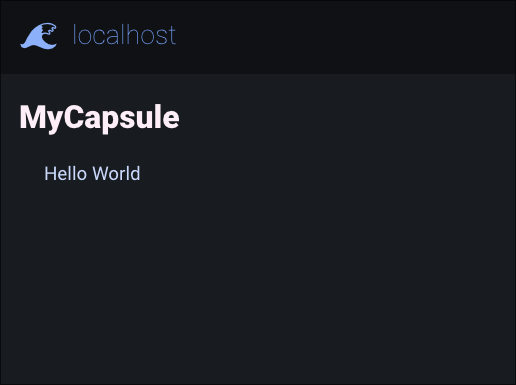

# Bunicap

Bunicap is a bun module that allows the easy development of gemini capsules

## Installation
```sh
bun install bunicap
```

## Usage

To get a minimal instance started:

```ts
// example.ts

import bunicap from "bunicap";

const capsule = new bunicap({tls:{
	// ... TLS information
}});

capsule.path("/", (req, res) => {
	res.send([
		"# MyCapsule",
		"Hello World"
	].join("\n"));
});

capsule.listen("::", 1965, (cap) => {
	console.log(cap.hostname, cap.port);
});
```

