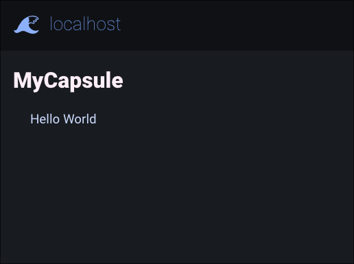

# Bunicap

[](https://github.com/IsCoffeeTho/bunicap/actions/workflows/test-bun.yml)

[**`git`**](https://github.com/IsCoffeeTho/bunicap) | [**`npm`**](https://www.npmjs.com/package/bunicap) | [**`wiki`**](https://github.com/IsCoffeeTho/bunicap/wiki)

Bunicap  is a bun module that allows the easy development of gemini capsules

[`Gemini Protocol`](https://geminiprotocol.net/docs/protocol-specification.gmi)  
[`GemText Specification`](https://geminiprotocol.net/docs/gemtext-specification.gmi)  

## Installation
```sh
bun install bunicap
```

## Usage

To get a minimal instance started:

In a shell:
```sh
bun install bunicap

bun run encrypt
# This will make the localhost certificates you will need
```

And in a file:

```ts
// example.ts
import bunicap from "bunicap";

const capsule = new bunicap({tls:{
	// ... TLS information
}});

capsule.path("/", (req, res) => {
	res.send([
		"# MyCapsule",
		"Hello World"
	].join("\n"));
});

capsule.path("*", (req, res) => {
	res.status(geminiStatus.).send("Capsule Not Found");
});

capsule.listen("::", 1965, (cap) => {
	console.log(cap.hostname, cap.port);
});
```

Then in your favourite gemini browser:

```
gemini://localhost/
```



## Development

```sh
# Unit Tests
bun test

# Mock Server @ gemini://localhost/
bun start
```

[`gemini://localhost/`](gemini://localhost/)